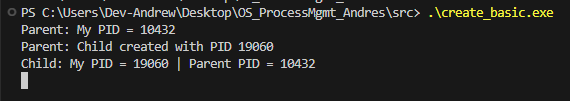
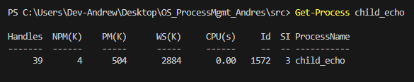

# OS Laboratory Activity 1 – Process Management  
**Name:** Andrew Andres  
**Course / Section:** BCA188 - B186.1

---

## 📌 Overview
This lab demonstrates process creation and management in Windows using the WinAPI.  
We implemented parent and child programs in C that showcase:  
- Creating processes (`CreateProcess`)  
- Waiting for processes (`WaitForSingleObject`, `WaitForMultipleObjects`)  
- Checking exit codes (`GetExitCodeProcess`)  
- Simulating `exec()` behavior  
- Managing processes via PowerShell (`Get-Process`, `Stop-Process`)  

---

## ⚙️ Build Instructions  

### Using VS Code with MinGW
1. Install **MinGW-w64** and add it to your PATH.  
2. Open the project folder in VS Code.  
3. Inside `src/`, compile programs with:  
   ```powershell
   gcc child_echo.c -o child_echo.exe
   gcc create_basic.c -o create_basic.exe
   gcc create_two_children.c -o create_two_children.exe
   gcc replace_sim.c -o replace_sim.exe
4. Run any parent program from PowerShell, e.g.:
   ```powershell
   .\create_basic.exe

### Tasks & Results

## Task A – Creating a Single Child
- Program: create_basic.c + child_echo.c
- Expected Behavior:
    - Parent prints its own PID.
    - Child prints its own PID and parent’s PID.
    - Parent waits for child and prints child’s exit code.
- Sample Output:


## Task B - Creating Two Children
- Program: create_two_children.c
- Expected Behavior:
    - Parent spawns two children in parallel.
    - Both children print their PIDs.
    - Parent waits until both children finish.
- Sample Output:


## Task C – Simulating exec()
- Program: replace_sim.c
- Expected Behavior:
    - Parent launches a replacement process (e.g., cmd /c dir).
    - Parent exits quickly with the same exit code as the spawned program.
- Sample Output:


## Task D – Managing Processes in PowerShell
- Programs: Any parent (e.g., create_basic.exe) with child_echo.exe.
- Steps:
    1. Run the parent to spawn a child process.
    2. Use Get-Process child_echo to list child process.
    3. Use Stop-Process -Id <PID> to force termination.

Sample PowerShell Session:

Starting create_basic.exe:


In another PowerShell window (Executing Get-Process child_echo):


Then forced terminate:


Result after forced terminating:


Output when create_basic.exe ends naturally:


## Difference Observed:
  - Normal termination: Exit code = 0 (child finished naturally).
  - Forced termination: Exit code is non-zero (abnormal termination).
